<a href="https://github.com/unhappychoice/weekly-report">
  <picture>
    <source media="(prefers-color-scheme: dark)" srcset="https://unhappychoice.github.io/weekly-report/card-dark.svg" />
    <source media="(prefers-color-scheme: light)" srcset="https://unhappychoice.github.io/weekly-report/card.svg" />
    
  </picture>
</a>

- A full stack software engineer
- Rust, TypeScript, Ruby, Swift, Kotlin, Scala
- Web, API, iOS, Android, SPA, Infrastructure, Everything to solve real-world problems
- ex: [@orderlyjp](https://github.com/orderlyjp) / [@seibii](https://github.com/seibii) / [@appbrew](https://github.com/appbrew) / [@oneteam-dev](https://github.com/oneteam-dev)

  
  
  
  
  

  
  

## Featured Projects

<!-- featured:start -->

  <a href="https://github.com/unhappychoice/splashboard">
    <picture>
      <source media="(prefers-color-scheme: dark)" srcset="./showcase-splashboard-dark.svg" />
      <source media="(prefers-color-scheme: light)" srcset="./showcase-splashboard.svg" />
      
    </picture>
  </a>
  <a href="https://github.com/unhappychoice/gitlogue">
    <picture>
      <source media="(prefers-color-scheme: dark)" srcset="./showcase-gitlogue-dark.svg" />
      <source media="(prefers-color-scheme: light)" srcset="./showcase-gitlogue.svg" />
      
    </picture>
  </a>
  <a href="https://github.com/unhappychoice/gittype">
    <picture>
      <source media="(prefers-color-scheme: dark)" srcset="./showcase-gittype-dark.svg" />
      <source media="(prefers-color-scheme: light)" srcset="./showcase-gittype.svg" />
      
    </picture>
  </a>
  <a href="https://github.com/unhappychoice/mdts">
    <picture>
      <source media="(prefers-color-scheme: dark)" srcset="./showcase-mdts-dark.svg" />
      <source media="(prefers-color-scheme: light)" srcset="./showcase-mdts.svg" />
      
    </picture>
  </a>

<!-- featured:end -->

  <a href="https://unhappychoice.com/oss/">See more →</a>

