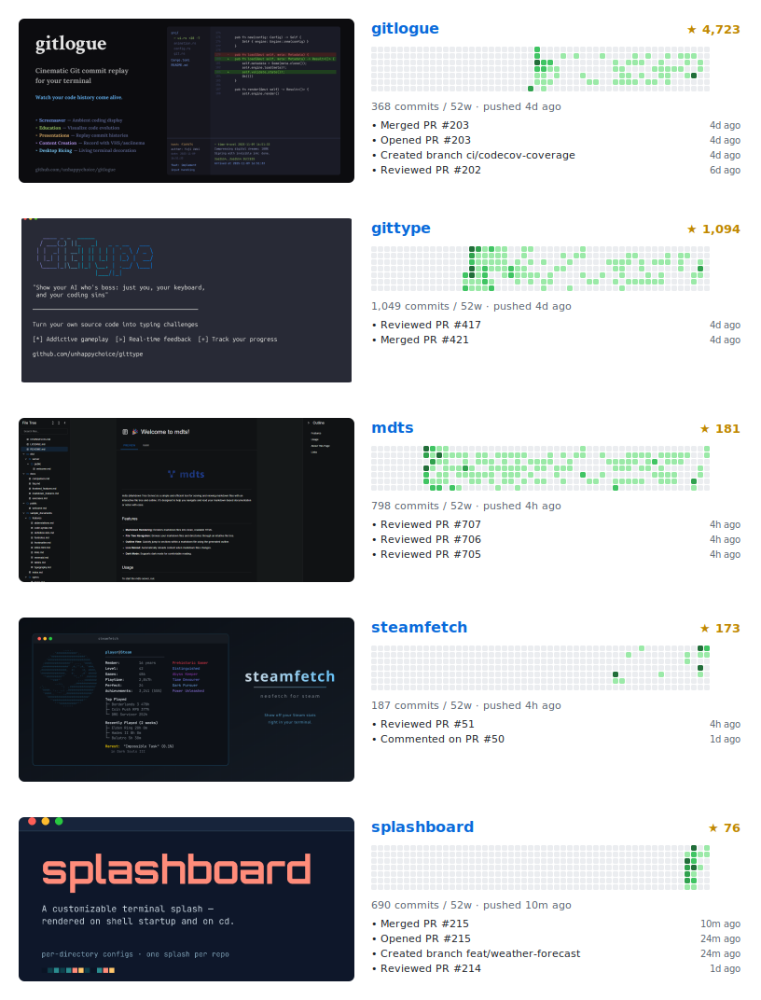

<a href="https://github.com/unhappychoice/weekly-report">
  <picture>
    <source media="(prefers-color-scheme: dark)" srcset="https://unhappychoice.github.io/weekly-report/card-dark.svg" />
    <source media="(prefers-color-scheme: light)" srcset="https://unhappychoice.github.io/weekly-report/card.svg" />
    
  </picture>
</a>

- A full stack software engineer
- Rust, TypeScript, Ruby, Swift, Kotlin, Scala
- Web, API, iOS, Android, SPA, Infrastructure, Everything to solve real-world problems
- ex: [@orderlyjp](https://github.com/orderlyjp) / [@seibii](https://github.com/seibii) / [@appbrew](https://github.com/appbrew) / [@oneteam-dev](https://github.com/oneteam-dev)

| Interests&nbsp;&nbsp;&nbsp;&nbsp;&nbsp;&nbsp;&nbsp;&nbsp;&nbsp;&nbsp;&nbsp;&nbsp;&nbsp;&nbsp;&nbsp;&nbsp;&nbsp;&nbsp;&nbsp;&nbsp;&nbsp;&nbsp;&nbsp;&nbsp;&nbsp;&nbsp;&nbsp;&nbsp;&nbsp;&nbsp;&nbsp;&nbsp;&nbsp;&nbsp;&nbsp;&nbsp;&nbsp;&nbsp;&nbsp;&nbsp;&nbsp;&nbsp;&nbsp;&nbsp; | Motto&nbsp;&nbsp;&nbsp;&nbsp;&nbsp;&nbsp;&nbsp;&nbsp;&nbsp;&nbsp;&nbsp;&nbsp;&nbsp;&nbsp;&nbsp;&nbsp;&nbsp;&nbsp;&nbsp;&nbsp;&nbsp;&nbsp;&nbsp;&nbsp;&nbsp;&nbsp;&nbsp;&nbsp;&nbsp;&nbsp;&nbsp;&nbsp;&nbsp;&nbsp;&nbsp;&nbsp;&nbsp;&nbsp;&nbsp;&nbsp;&nbsp;&nbsp;&nbsp;&nbsp;&nbsp;&nbsp;&nbsp;&nbsp;&nbsp;&nbsp;&nbsp;&nbsp;&nbsp;&nbsp;&nbsp;&nbsp;&nbsp;&nbsp;&nbsp;&nbsp;&nbsp;&nbsp; | Links&nbsp;&nbsp;&nbsp;&nbsp;&nbsp;&nbsp;&nbsp;&nbsp;&nbsp;&nbsp;&nbsp;&nbsp;&nbsp;&nbsp;&nbsp;&nbsp;&nbsp;&nbsp;&nbsp;&nbsp;&nbsp;&nbsp;&nbsp;&nbsp;&nbsp;&nbsp;&nbsp;&nbsp;&nbsp;&nbsp;&nbsp;&nbsp;&nbsp;&nbsp;&nbsp;&nbsp;&nbsp;&nbsp;&nbsp;&nbsp;&nbsp;&nbsp;&nbsp;&nbsp;&nbsp; |
|:--------- |:----- |:----- |
|  <ul><li>Programming :computer: &nbsp;( obviously</li><li>UI design :art:</li><li>Math / Physics</li><li>Drumming :drum: &nbsp;/ Singing :microphone:</li><li>SF movies :clapper:</li></ul> | <blockquote>Knowledge is power, France is Bacon</blockquote>:fr: `==` :bacon:  Ref: [Reddit comment](https://www.reddit.com/r/AskReddit/comments/dxosj/comment/c13pbyc) |  <ul><li>[blog](https://blog.unhappychoice.com)</li><li>[RubyGems.org](https://rubygems.org/profiles/unhappychoice)</li><li>[npm](https://www.npmjs.com/~unhappychoice)</li><li>[Linkedin](https://www.linkedin.com/in/裕史-上木-4a17a5101)</li><li>[Twitter](https://twitter.com/unhappychoice_e)</li></ul>|

   

## Featured Projects

<!-- featured:start -->
<table>
  <tr>
    <td align="center" colspan="4"></td>
  </tr>
  <tr>
    <td align="center" width="25%"></td>
    <td align="center" width="25%"></td>
    <td align="center" width="25%"></td>
    <td align="center" width="25%"></td>
  </tr>
</table>
<!-- featured:end -->

## Activity

<picture>
  <source media="(prefers-color-scheme: dark)" srcset="./showcase-dark.svg" />
  <source media="(prefers-color-scheme: light)" srcset="./showcase.svg" />
  
</picture>

## Recent

<!-- activity:start -->
- Starred [kawarimidoll/typograssy](https://github.com/kawarimidoll/typograssy) — *5m ago*
- Opened PR [#2](https://github.com/unhappychoice/unhappychoice/pull/2) in [unhappychoice/unhappychoice](https://github.com/unhappychoice/unhappychoice) — *7m ago*
- Reviewed PR [#707](https://github.com/unhappychoice/mdts/pull/707) in [unhappychoice/mdts](https://github.com/unhappychoice/mdts) — *4h ago*
- Reviewed PR [#706](https://github.com/unhappychoice/mdts/pull/706) in [unhappychoice/mdts](https://github.com/unhappychoice/mdts) — *4h ago*
- Reviewed PR [#705](https://github.com/unhappychoice/mdts/pull/705) in [unhappychoice/mdts](https://github.com/unhappychoice/mdts) — *4h ago*
- Reviewed PR [#51](https://github.com/unhappychoice/steamfetch/pull/51) in [unhappychoice/steamfetch](https://github.com/unhappychoice/steamfetch) — *4h ago*
<!-- activity:end -->

